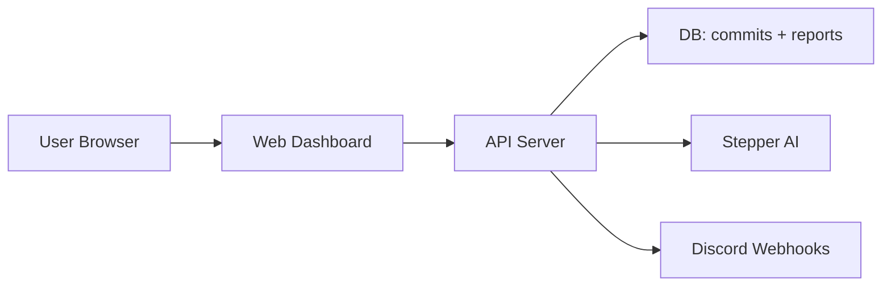

# Commit Diary Web Dashboard 🚀

A **modern, responsive web dashboard** for visualizing git commit history and analytics.

- Back to root: [../../README.md](../../README.md)
- Related packages: [../api/README.md](../api/README.md) • [../extension/README.md](../extension/README.md) • [../stepper/README.md](../stepper/README.md) • [../core/README.md](../core/README.md)

---

## 📋 Features

- ⚡ Built with **Next.js 13**
- 🎨 Modern UI with React Bootstrap
- 📊 Pre-built analytics widgets
- 🔌 Integrated with Supabase Auth
- 📱 Fully responsive
- 🔔 **Discord Webhook Notifications** - Configure your Discord server to receive real-time commit reports
- 🔑 **API Key Management** - Generate and manage API keys for VS Code extension sync
- 📈 **Commit Analytics** - View metrics, categories, and insights
- 🤖 **AI Report Generation** - Trigger and view AI-powered commit reports
- 🔐 **Secure Sharing** - Create public links to share commit history

---

## 🔁 Package Flow



---

## 📂 Getting Started

### 1️⃣ Installation

```bash
pnpm install
```

### 2️⃣ Environment Configuration

Create `.env.local` file:

```env
NEXT_PUBLIC_SUPABASE_URL=https://your-project.supabase.co
NEXT_PUBLIC_SUPABASE_ANON_KEY=your-anon-key
NEXT_PUBLIC_API_URL=http://localhost:3001
```

### 3️⃣ Start Development Server

```bash
pnpm dev
```

Now, open [http://localhost:3000](http://localhost:3000) in your browser.

### 4️⃣ Build for Production

```bash
pnpm build
```

## ✅ Why This Setup Works

- Supabase handles authentication and session state in the browser
- API URL points the UI to the local server for data and reports
- Next.js dev server provides fast iteration with shared components

---

## 🔗 How It Connects to CommitDiary

- Reads commit analytics, reports, and settings from the API: [../api/README.md](../api/README.md)
- Manages API keys used by the extension: [../extension/README.md](../extension/README.md)
- Triggers AI report generation via API → Stepper: [../stepper/README.md](../stepper/README.md)
- Relies on shared analytics logic from core: [../core/README.md](../core/README.md)

---

## 🔔 Discord Webhook Configuration

The dashboard allows users to configure Discord webhooks for receiving commit report notifications.

### Setup Discord Webhook in Dashboard

1. **Navigate to Settings**:
   - Log in to the dashboard
   - Go to **Settings** page
   - Scroll to **Discord Notifications** section

2. **Create Discord Webhook**:
   - Open your Discord server
   - Go to **Server Settings** → **Integrations** → **Webhooks**
   - Click **Create Webhook** or **New Webhook**
   - Configure:
     - **Name**: CommitDiary Notifications
     - **Channel**: Select where you want reports
   - Click **Copy Webhook URL**

3. **Configure in Dashboard**:
   - Paste the webhook URL in the input field
   - Select events you want to receive:
     - `report_completed` - AI report generated successfully
     - `report_failed` - Report generation failed
     - `backfill_started` - Automatic backfill began
     - `backfill_completed` - Backfill finished
     - `backfill_failed` - Backfill encountered errors
     - `sync_completed` - Commit sync completed
     - `repo_enabled` - Auto-reports enabled for repository
   - Click **Save Settings**

4. **Test Your Webhook**:
   - Click **Send Test** button
   - Check your Discord channel for the test message
   - View delivery logs to troubleshoot any issues

### Webhook Features

- ✅ **Rich Embeds**: Beautiful Discord messages with commit details, AI summaries, and metadata
- 🔒 **Secure**: HMAC-SHA256 signature verification for all webhook deliveries
- 📊 **Statistics**: View delivery success rate, last delivery time, and failure count
- 📝 **Delivery Logs**: Track all webhook deliveries with status codes and error messages
- 🔄 **Retry Logic**: Automatic exponential backoff retry for failed deliveries
- ⚡ **Rate Limiting**: Respects Discord's 30 requests/minute limit with intelligent queuing

### Webhook Notification Format

Reports are delivered as Discord embeds with:

- **Title**: AI-generated report title
- **Summary**: Concise commit summary
- **Fields**:
  - Commit SHA and author
  - Date and category
  - Tags and AI provider used
  - Key changes list
  - Rationale and impact analysis
  - Next steps suggestions
- **Footer**: Generation time and metadata

---

## 🚀 Deployment

The dashboard can be easily deployed to Vercel or any other Next.js compatible hosting provider.

---

## 🤝 Contributing

1. Follow Getting Started above
2. Ensure NEXT_PUBLIC_API_URL points at a local API
3. Run pnpm dev and verify key flows: auth, commits, reports, webhooks
4. Submit PRs via the monorepo

Start from [../../README.md](../../README.md) for full monorepo instructions.
