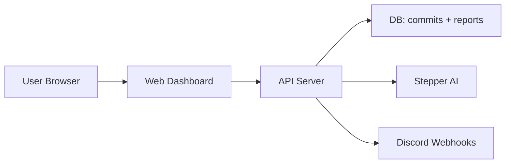

# Commit Diary Web Dashboard 🚀

A **modern, responsive web dashboard** for visualizing git commit history and analytics.

- Back to root: [../../README.md](../../README.md)
- Related packages: [../api/README.md](../api/README.md) • [../extension/README.md](../extension/README.md) • [../stepper/README.md](../stepper/README.md) • [../core/README.md](../core/README.md)

---

## 📋 Features

- ⚡ Built with **Next.js 13**
- 🎨 Modern UI with React Bootstrap
- 📊 Pre-built analytics widgets
- 🔌 Integrated with Supabase Auth
- 📱 Fully responsive
- 🔔 **Discord Webhook Notifications** - Configure your Discord server to receive real-time commit reports
- 🔑 **API Key Management** - Generate and manage API keys for VS Code extension sync
- 📈 **Commit Analytics** - View metrics, categories, and insights
- 🤖 **AI Report Generation** - Trigger and view AI-powered commit reports
- 🔐 **Secure Sharing** - Create public links to share commit history

---

## 🔁 Package Flow


```mermaid
flowchart LR
   A[User Browser] --> B[Web Dashboard]
   B --> C[API Server]
   C --> D[DB: commits + reports]
   C --> E[Stepper AI]
   C --> F[Discord Webhooks]
```

---

## 📂 Getting Started

### 1️⃣ Installation

```bash
pnpm install
```

### 2️⃣ Environment Configuration

Create `.env.local` file:

```env
NEXT_PUBLIC_SUPABASE_URL=https://your-project.supabase.co
NEXT_PUBLIC_SUPABASE_ANON_KEY=your-anon-key
API_URL=http://localhost:3001
```

### 3️⃣ Start Development Server

```bash
pnpm dev
```

Now, open [http://localhost:3000](http://localhost:3000) in your browser.

### 4️⃣ Build for Production

```bash
pnpm build
```

## ✅ Why This Setup Works

- Supabase handles authentication and session state in the browser
- API URL points the UI to the local server for data and reports
- Next.js dev server provides fast iteration with shared components

---

## 🔗 How It Connects to CommitDiary

- Reads commit analytics, reports, and settings from the API: [../api/README.md](../api/README.md)
- Manages API keys used by the extension: [../extension/README.md](../extension/README.md)
- Triggers AI report generation via API → Stepper: [../stepper/README.md](../stepper/README.md)
- Relies on shared analytics logic from core: [../core/README.md](../core/README.md)

---

## 🔔 Discord Webhook Configuration

The dashboard allows users to configure Discord webhooks for receiving commit report notifications.

### Setup Discord Webhook in Dashboard

1. **Navigate to Settings**:
   - Log in to the dashboard
   - Go to **Settings** page
   - Scroll to **Discord Notifications** section

2. **Create Discord Webhook**:
   - Open your Discord server
   - Go to **Server Settings** → **Integrations** → **Webhooks**
   - Click **Create Webhook** or **New Webhook**
   - Configure:
     - **Name**: CommitDiary Notifications
     - **Channel**: Select where you want reports
   - Click **Copy Webhook URL**

3. **Configure in Dashboard**:
   - Paste the webhook URL in the input field
   - Select events you want to receive:
     - `report_completed` - AI report generated successfully
     - `report_failed` - Report generation failed
     - `backfill_started` - Automatic backfill began
     - `backfill_completed` - Backfill finished
     - `backfill_failed` - Backfill encountered errors
     - `sync_completed` - Commit sync completed
     - `repo_enabled` - Auto-reports enabled for repository
   - Click **Save Settings**

4. **Test Your Webhook**:
   - Click **Send Test** button
   - Check your Discord channel for the test message
   - View delivery logs to troubleshoot any issues

### Webhook Features

- ✅ **Complete Rich Embeds**: Long reports continue in ordered messages without dropping report sections
- 🔒 **Safe Mentions**: Report text cannot trigger Discord mentions
- 📊 **Statistics**: View delivery success rate, last delivery time, and failure count
- 📝 **Delivery Logs**: Track all webhook deliveries with status codes and error messages
- 🔄 **Retry Logic**: Automatic exponential backoff retry for failed deliveries
- ⚡ **Rate Limiting**: Queues deliveries and follows Discord's response-specific retry timing

### Webhook Notification Format

Reports are delivered as Discord embeds with:

- **Title**: AI-generated report title
- **Summary**: Concise commit summary
- **Fields**:
  - Commit SHA and author
  - Date and category
  - Tags and AI provider used
  - Key changes list
  - Rationale and impact analysis
  - Next steps suggestions
- **Footer**: Generation time and metadata

When a report exceeds Discord's per-message limits, CommitDiary sends numbered continuation messages in order until every report section is delivered.

---

## 🚀 Deployment

The marketing site and authenticated product deploy as one Next.js application. Runtime middleware
routes each configured host without embedding deployment URLs in source code:

- `NEXT_PUBLIC_MARKETING_URL` serves the landing page at `/`.
- `NEXT_PUBLIC_APP_URL` serves the product dashboard at `/` and owns authentication callbacks.
- When either value is blank, local and generated preview URLs keep path-based routing (`/` for
  marketing and `/dashboard` for the product).

Set both values as absolute origins for every environment. For example, production can use the apex
and app subdomain while staging uses its own two hostnames. Also add the app origin plus
`/api/auth/callback` to the Supabase redirect URL allowlist.

### Vercel setup

Run these commands from the repository root. The CLI prompts for environment-variable values, which
keeps secrets and environment-specific URLs out of shell history and source control.

```bash
pnpm dlx vercel link --cwd packages/web-dashboard
pnpm dlx vercel env add NEXT_PUBLIC_MARKETING_URL production --cwd packages/web-dashboard
pnpm dlx vercel env add NEXT_PUBLIC_APP_URL production --cwd packages/web-dashboard
pnpm dlx vercel env add NEXT_PUBLIC_MARKETING_URL preview --cwd packages/web-dashboard
pnpm dlx vercel env add NEXT_PUBLIC_APP_URL preview --cwd packages/web-dashboard
pnpm dlx vercel env add NEXT_PUBLIC_SUPABASE_URL production --cwd packages/web-dashboard
pnpm dlx vercel env add NEXT_PUBLIC_SUPABASE_ANON_KEY production --cwd packages/web-dashboard
pnpm dlx vercel env add API_URL production --cwd packages/web-dashboard
pnpm dlx vercel env add NEXT_PUBLIC_GITHUB_URL production --cwd packages/web-dashboard
pnpm dlx vercel env add NEXT_PUBLIC_MARKETPLACE_URL production --cwd packages/web-dashboard
pnpm dlx vercel env add NEXT_PUBLIC_STEPPER_URL production --cwd packages/web-dashboard
pnpm dlx vercel env add NEXT_PUBLIC_DOCS_URL production --cwd packages/web-dashboard
pnpm dlx vercel env add NEXT_PUBLIC_DISCORD_DOCS_URL production --cwd packages/web-dashboard
```

Attach both production domains to the same linked Vercel project, replacing `<project-name>` with the
project selected during `vercel link`:

```bash
pnpm dlx vercel domains add commitdiary.dev <project-name>
pnpm dlx vercel domains add app.commitdiary.dev <project-name>
```

Create a preview deployment or deploy to production:

```bash
pnpm --filter @commitdiary/web-dashboard deploy:preview
pnpm --filter @commitdiary/web-dashboard deploy:production
```

Vercel Pro and Enterprise projects can use a dedicated custom `staging` environment instead of
Preview. Configure its two URL variables with `vercel env add <name> staging`, then deploy with
`pnpm dlx vercel deploy --target=staging --cwd packages/web-dashboard`.

---

## 🤝 Contributing

1. Follow Getting Started above
2. Ensure API_URL points at a local API
3. Run pnpm dev and verify key flows: auth, commits, reports, webhooks
4. Submit PRs via the monorepo

Start from [../../README.md](../../README.md) for full monorepo instructions.
